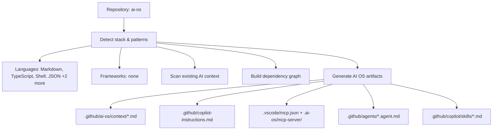

# Architecture — ai-os

> Auto-generated by AI OS. Update this file as the architecture evolves.

## Project Type

**Markdown** project.

## Directory Structure

```
bootstrap.sh
bundle/
dist/
Dockerfile
install.sh
package-lock.json
package.json
README.md
scripts/
skill-creator/
skills-lock.json
src/
tsconfig.json
vitest.config.ts
```

## Data Flow

_Update this section with your actual data flow._

## Integration Points

_List external services, APIs, and third-party integrations here._

## Visual Architecture Overview



_Open this file in VS Code Markdown Preview to view the diagram._