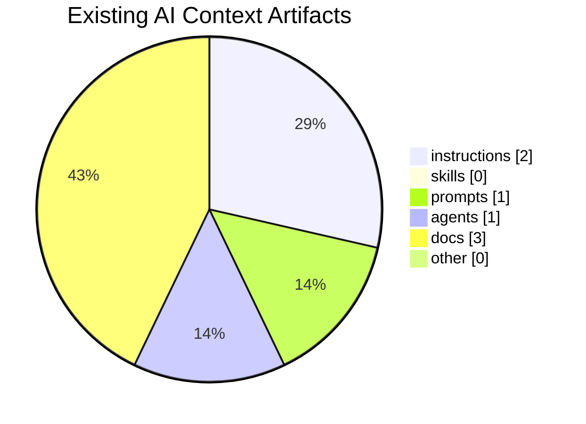

# Existing AI Context — ai-os

> Auto-generated by AI OS. This report detects existing AI guidance and suggests a Git Bash-first optimization path.

## Detection Summary

- Total detected AI artifacts: **7**
- Copilot instructions: **2**
- Copilot skills: **0**
- Prompt registries: **1**
- Agent files: **1**
- AI docs/context files: **3**
- Other assistant configs: **0**

## Detected Artifacts

- [instructions] `.github/copilot-instructions.md`
- [instructions] `.github/instructions/`
- [prompts] `.github/copilot/prompts.json`
- [agents] `.github/agents/ (4 files)`
- [docs] `.github/ai-os/context/stack.md`
- [docs] `.github/ai-os/context/architecture.md`
- [docs] `.github/ai-os/context/conventions.md`

## Optimization Plan (Git Bash-First)

1. Refresh generated artifacts in-place (safe for existing repos):
```bash
npm run generate -- --cwd "$PWD" --refresh-existing
```
2. Re-run installer in refresh mode when onboarding or syncing:
```bash
bash install.sh --cwd "$PWD" --refresh-existing
```
3. Keep Copilot as the single active target for generated instructions, prompts, and skills.
4. Treat `.github/ai-os/context/*.md` files as source-of-truth and update them after architectural changes.

## Notes

- This workflow is shell-driven (Git Bash + Node.js) and does not require Python runtime scripts.
- Existing files are preserved in safe mode and updated intentionally in refresh mode.

## Visual Artifact Breakdown



_Open this file in VS Code Markdown Preview to view the diagram._