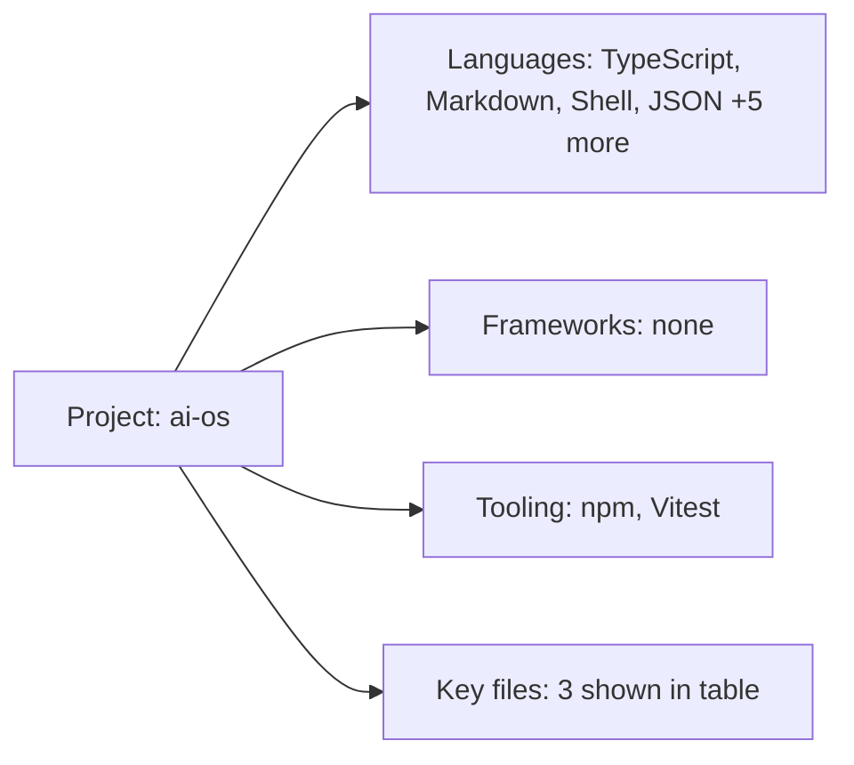

# Tech Stack — ai-os

## Languages

- **TypeScript** — 86 files (45%) | extensions: .ts
- **Markdown** — 75 files (39%) | extensions: .md
- **Shell** — 12 files (6%) | extensions: .sh
- **JSON** — 7 files (4%) | extensions: .json
- **JavaScript** — 5 files (3%) | extensions: .js, .mjs
- **PHP** — 2 files (1%) | extensions: .php
- **HTML** — 2 files (1%) | extensions: .html
- **Go** — 1 files (1%) | extensions: .go
- **Python** — 1 files (1%) | extensions: .py

## Frameworks & Libraries

- TypeScript (no framework detected)

## Build & Tooling

- **Package Manager:** npm
- **Bundler:** esbuild
- **Linter:** ESLint
- **Test Framework:** Vitest
- **CI/CD:** GitHub Actions
- **TypeScript:** Yes
- **Docker:** Yes
- **Monorepo:** No

## Key Files

- `README.md`
- `package.json`
- `Dockerfile`

## MCP Parity Signals

- Detected language families for parity checks: TypeScript, JavaScript, Go, Python
- Route discovery, package/build introspection, and env-convention scanning are enabled per detected stack.

## Visual Stack Map

_Open this file in VS Code Markdown Preview to view the diagram._